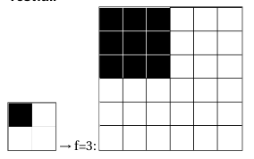

# Software Engineering

## by Daniel Glinka

---

# Arrays

- [Referenz](https://processing.org/reference/Array.html)

+++

## Eigenschaften

- Datentyp
- Speichert eine Menge von Werten
- Elemente haben gleichen Datentyp
- Werte werden mittels Index abgeändert oder abgefragt
- Ein Index startet bei 0

+++

### Beispiel

```java
koordinaten[3] = wert;

wert = koordinaten[3];
```

+++

### Variabler Index

```java
for(int i=0; i < anzahlWerte; i++) {
  koordinaten[i] = initialerWert;
}
```

+++

## Deklaration/Speicher Allokierung

- Erstellt einen neuen Array
- Gibt den Datentyp des Arrays vor
- Anders als bei bisher bekannten Datentypen muss für Arrays Speicher
  reserviert/allokiert werden

+++

### Beispiel

```java
int[] koordinaten; // Deklaration

// Speicher Allokierung mit 15 Elementen
// Danach hat jedes der Elemente den Wert 0
koordinaten = new int[15];

int[] koordinaten = new int[15]; // alles in einem Schritt

// Deklaration und Allokierung mit festgelegten Werten
String[] farben = {"rot", "gelb", "grün"}
```

+++

## Dimensionen

- Arrays können mehrere Dimensionen haben
- z.B. Koordinaten mit x und y

```java
// Zweidimensionaler Array
int[][] koordinaten = new int[anzahlX][anzahlY]
```

+++

## Länge

- ein Array hat automatisch die Eigenschaft `length`

```java
int anzahlElemente = koordinaten.length;
```

---

# Übungen

+++

## Tankfüllung

Schreibe eine Funktion, die ein Array mit verschiedenen `int`-Werten übergeben
bekommt und daraus die durchschnittliche Anzahl an Kilometern zurückgibt, die
wir mit einer Tankfüllung fahren können.

```
[123, 134, 120, 122] -> 124.75
```

+++

###### Tipps

- Summiere alle Kilometer
- Berechne den Mittelwert (Summe / Anzahl der Werte)
- Achte auf die richtigen Datentypen

+++

###### Hilfe

```java
// Funktion zur Berechnung des durchschnittlichen Verbrauchs
// An die Funktion wird ein Array mit Integer-Werten übergeben,
// die die gefahrenen Kilometer bis zum nächsten Tankstopp
// enthalten. Die Funktion gibt den Durchschnittswert als
// Fließkommazahl zurück.

// Erstelle eine Funktion averageFuelComsumption welche den Array
// kilometersPerTankful als Parameter erhält
/* ... */

  // Initialisierung der Variablen averageConsumption und
  // sumKilometers für die Berechnung des Mittelwerts
  /*...*/

  // Summiere alle Kilometer
  /*...*/

  // Teile durch Gesamtzahl
  /*...*/

  // Rückgabe des Ergebnisses
  /*...*/

// Startpunkt des Hauptprogramms
// Hier wird die implementierte Funktion zu Demonstrations- und
// Testzwecken aufgerufen.

// Erstelle die Funktion setup, welche das Ergebnis der
// Funktion averageFuelComsumption in der Console ausgibt
/*...*/
```

+++

## Rückwärtsausgabe

Programmiere eine Funktion, welche Wörter rückwärts schreibt. Dabei soll ihr ein
Char-Array übergeben werden, welcher die Buchstaben rückwärts in der Konsole ausgiebt.

z.B. Hallo -> ollaH

+++

##### Tipps

- du kannst den Array rückwärts oder vorwärts durchgehen. Beim letzteren
  benötigst du wahrscheinlich eine Hilfsvariable.
- jeder Array hat eine `length` Variable ([Referenz](https://processing.org/reference/Array.html))

+++

##### Hilfe

```java
// Programmiere die Funktion printBackwards, welche keinen Rückgabewert
// hat und als Parameter einen char-Array erhält.
// Die Funktion soll den übergeben char-Array in der
// umgekehrten Reihenfolge in der Konsole ausgeben.
/*...*/

// Startpunkt des Hauptprogramms
// Hier wird die implementierte Funktion zu Demonstrations- und
// Testzwecken aufgerufen.
void setup() {
  // Char Array mit Test Daten
  char[] palindrom =
    {'r', 'e', 'i', 'b', 'n', 'i', 'e', 'e', 'i', 'n', 'b', 'i', 'e', 'r'};

  // Char Array mit Test Daten
  char[] test = {'H', 'a', 'l', 'l', 'o'};

  // Hier wird die Funktion printBackwards mit dem entsprechenden Parameter aufgerufen
  printBackwards(palindrom);
  printBackwards(test);
}
```

+++

## Bildvergrößerung

Digitale Bilder werden in der Regel durch Bildelemente, sogenannte Pixel,
unterteilt und dargestellt. Jedes Pixel beschreibt dabei einen Farbton an einer
festgelegten Stelle. Es ist also ein großes Array, in denen verschiedene Zahlen
(die Farbwerte) gespeichert sind. Pixel werden meist quadratisch dargestellt. In
dieser Aufgabe werden wir zwei Farben im Bild-Array speichern: schwarz und weiß.
Eine typische Anwendung in Bildbearbeitungssoftware ist die Bildvergrößerung,
welche wir hier programmieren wollen.

+++

Programmiere ein Programm, welches einen zweidimensionales Array um einen
Ganzzahligen Faktor f vergrößert. Dieser Faktor ist größer als 1. Das Array ist
quadratisch und besteht aus `boolean`-Werten.
Stelle die Vergrößerung grafisch in einer separaten Funktion dar.

+++



+++

##### Tipps:

- Mache dir eine Papier skizze, damit zu weißt welche Werte vom Ausgangbild wo
  stehen müssen.
- Du benötigst eine 4-Fach verschachtelte Schleife
  - Iteration durch Zeilen
  - Iteration durch Spalten
  - Iteration für den Zeilenfaktor
  - Iteration für den Spaltenfaktor

+++

##### Hilfe

```java
// Erstelle die Funktion magnify, welche ein Zweidimensionales Boolean-Array
// input und einen Ganzzahlingen Vergrößerungsfaktor f als Parameter erhält.
// Der Rückgabetyp ist ebenfalls ein Zeidimensionales Boolean-Array.

/*...*/

// Erstelle die Funkion drawArray, welche ein Zweidimensionales Booles-Array
// als Parameter erhält und keine Rückgabetyp hat.
// Die Funktion soll das vergrößerte Array Grafisch darstellen.
// Die Rechteckgrößen sollen dabei durch die Ausgabefenstergröße bestimmt
// werden.

/*...*/

// Startpunkt des Hauptprogramms
// Hier wird die implementierte Funktion zu Demonstrations- und
// Testzwecken aufgerufen.
void setup() {
  size(200, 200);
  background(255);
  boolean[][] input = {{true, false}, {false, false}};
  drawArray(magnify(input, 1));
}
```

+++

### Morsecode

Schreibe ein Programm, welches Zeichenketten in Morsezeichen codiert.

+++

##### Beispiel

```
Text:
wozuwortedruckenesgibtdochschreiber

Ergebnis:
 .-- --- --.. ..- .-- --- .-. - . -.. .-. ..- -.-. -.- . -. . ... --. ..-... - -.. --- -.-. .... ... -.-. .... .-. . .. -... . .-.
```

+++

##### Morse Alphabet

```java
".-",     // A
"-...",   // B
"-.-.",   // C
"-..",    // D
".",      // E
"..-.",   // F
"--.",    // G
"....",   // H
"..",     // I
".---",   // J
"-.-",    // K
".-..",   // L
"--",     // M
"-.",     // N
"---",    // O
".--.",   // P
"--.-",   // Q
".-.",    // R
"...",    // S
"-",      // T
"..-",    // U
"...-",   // V
".--",    // W
"-..-",   // X
"-.--",   // Y
"--..",   // Z
".----",  // 1
"..---",  // 2
"...--",  // 3
"....-",  // 4
".....",  // 5
"-....",  // 6
"--...",  // 7
"---..",  // 8
"----.",  // 9
"-----"   // 0
```

+++

##### Tipps

- ein selbst erstelltes "Nachschlagewerk" mit den Codes ist sinnvoll
- Entferne zunächst alle Leerzeichen und wandle alle Großbuchstaben in
  Kleinbuchstaben um
- Gehe jedes Zeichen einzeln durch und ersetze es mit dem zugehörigen Morsezeichen

+++

##### Hilfe

```java

```
