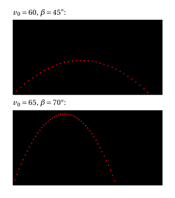

# Software Engineering

## by Daniel Glinka

# Funktionen

+++

- Eine Menge von Anweisungen
- Code separieren
- Code mehrfach verwenden

+++

## Vorteile

- Code bleibt übersichtlich
- Geringerer Schreibaufwand
- Weniger Fehler
- Änderungen müssen nur an einer Stelle gemacht werden

---

## Syntax (Java)

- Rückgabetyp
- Funktionsname
- Parameterliste
- Anweisungsblock

+++

#### Signatur

Funktionen müssen EINDEUTIG identifizierbar sein. Die "Signatur" um sie identifizierbar zu machen besteht aus:

- Rückgabetyp
- Funktionsname
- Parameterliste

+++

```java
int BerechneSumme(int a, int b) {
  // Anweisungen zur Berechnung
  return ergebnis;
}
```

+++

#### Rückgabetyp

Der Rückgabetyp entspricht dem Datentyp, des Elements das nach dem `return`-Statement angegeben wird.

Wenn die Funktion keinen Wert zurück gibt, verwendet man den Rückgabetyp `void`.

+++

#### Funktionsname

- Frei wählbar
- Beschreibt den Sinn/die Aufgabe der Funktion
- Funktion erfüllt NUR was der Name beschreibt

+++

##### Beispiel:

Funktion `BerechneGehalt` sollte nur das Gehalt berechnen und zurückgeben. NICHT!! den Datensatz laden, nach der Berechnung speichern und in der Konsole ausgeben.

=> 4 verschiedene Funktionen verwenden.

+++

#### Parameterliste

- Parameter sind optional
- Parameter sind durch Komma getrennt
- Beliebige Anzahl (je weniger desto besser)

+++

##### Gültigkeit

Wie bei Blöcken sind Variablen/Parameter nur innerhalb des Funktionsblock gültig. Wenn Variable benötigt wird, sollte diese als Parameter übergeben werden.

---

# Übungen

+++

## Endliches Produkt

Das endliche Produkt ist eine mathematische Funktion und multipliziert Zahlen von einem Startwert s bis zu einen Endwert e.

- e oder s < 0 --> Ergebnis 0
- e oder s == 0 --> Ergebnis 0
- e < s --> vertausche e und s

+++

Schreibe eine Funktion, welche das "endliche Produkt" berechnet.

```java
Startwert s, Endwert e

s = 3, e = 4 --> 12
s = 5, e = 2 --> 120
s = -3, e = 5 --> 0
s = 33, e = 0 --> 0
s = 0, e = 33 --> 0
```

+++

##### Tipp:

- Überlege wie Parameterliste aussehen muss. Welche Parameter und welchen Datetyp diese haben.
- Überlege, ob die Funktion einen Wert zurückliefert. Berechnet die Funktion ein Ergebnis, das zurückgegeben werden soll?
- Bedingte Anweisungen und Wiederholungsanweisungen werden im Funktionsblock benötigt.

+++

##### Hilfe:

```java
// Erstelle eine Funktion mit dem Namen product, welche den Startwert s und
// Endwert e als Parameter erhält. Die Funktion soll das Ergebnis der Berechnung
// zurückliefern.
/*...*/ product(/*...*/) {

  // Ist einer der beiden Werte kleiner 0?
  // Wenn das zutrifft, soll 0 zurückgegeben werden
  /*...*/
  // Ist einer der beiden Werte gleich 0?
  // Wenn das zutrifft, soll 0 zurückgegeben werden
  /*...*/
  // Ist e kleiner s?
  // Vertausche die Werte
  /*...*/


  // Deklaration und Initialisierung der Variablen für das Ergebnis
  // Der Startwert muss 1 sein (wegen Multiplikation)
  int result = 1;

  // Zähle vom Start- bis Endwert
  // und multipliziere die Zahl mit dem Ergebnis
  /*...*/

  // Das Ergebnis zurückliefern
  return result;
}

// Startpunkt des Hauptprogramms
// Hier wird die implementierte Funktion zu Demonstrations- und
// Testzwecken aufgerufen.
void setup() {
  int result = product(4, 3);
  println("product(4, 3): " + result);
}
```

+++

## Fakultät berechnen

Die Fakultät ist eine mathematische Funktion und multipliziert alle natürlichen Zahlen vom Startwert 1 bis zum Endwert n.

+++

Programmiere eine Funktion, die die Faktultät für eine natürliche Zahl n berechnet.

```
n = 6 --> 720
n = 2 --> 2
n = 1 --> 1
n = 9 --> 362880
```

+++

##### Tipp:

- Schau dir das Programm zum endlichen Produkt noch einmal an

+++

##### Hilfe:

```java
// Erstelle eine Funktion factorial, welche den Endwert n
// als Parameter erhält und die Fakultät des Wertes berechnet.
// Tipp: rufe in der Funktion die Berechnung des endlichen Produktes auf
/*...*/

void setup() {
  int result = factorial(6);
  println(result);
}
```

+++

##### Lösung

```java
// Erstelle eine Funktion mit dem Namen product, welche den Startwert s und
// Endwert e als Parameter erhält. Die Funktion soll das Ergebnis der Berechnung
// zurückliefern.
int product(int e, int s) {

  // Ist einer der beiden Werte kleiner 0?
  // Wenn das zutrifft, soll 0 zurückgegeben werden
  if(s < 0 || e < 0) {
    return 0;
  }

  // Ist einer der beiden Werte gleich 0?
  // Wenn das zutrifft, soll 0 zurückgegeben werden
  if(s == 0 || e == 0) {
    return 0;
  }

  // Ist e kleiner s?
  // Vertausche die Werte
  if (e < s) {
    int tmp = e;
    e = s;
    s = tmp;
  }


  // Deklaration und Initialisierung der Variablen für das Ergebnis
  // Der Startwert muss 1 sein (wegen Multiplikation)
  int result = 1;

  // Zähle vom Start- bis Endwert
  // und multipliziere die Zahl mit dem Ergebnis
  for(int i = s; i <= e; i++) {
    result = result * i;
  }

  // Das Ergebnis zurückliefern
  return result;
}

// Erstelle eine Funktion factorial, welche den Endwert n
// als Parameter erhält und die Fakultät des Wertes berechnet.
int factorial(int n) {
 return product(1,n);
}

// Startpunkt des Hauptprogramms
// Hier wird die implementierte Funktion zu Demonstrations- und
// Testzwecken aufgerufen.
void setup() {
  int result = factorial(6);
  println("product(8, 15): " + result);
}
```

+++

## Pong

Programmiere das Spiel Pong.


+++

```java
float x;
float y;
float speedX;
float speedY;
int rectSize = 100;
int diameter = 10;

void setup() {
  size(500, 500);
  reset();
}

void reset() {
 x = width/2;
 y = height/2;
 speedX = 1;
 speedY = 5;
}

void draw() {
  background(120,120,120);
  rect(mouseX-rectSize/2, height-30, rectSize, 10);

  circle(x,y, diameter);

  x += speedX;
  y += speedY;

  if(y > height - 30 && y < height - 20 && x < mouseX + rectSize/2 && x > mouseX - rectSize/2) {
    speedY = speedY*-1;
    rectSize = rectSize - 10;
  }

  if(y < 0){
    speedY = speedY*-1;
  }

  if(x < 0 || x > width){
    speedX = speedX*-1;
  }
}

void mousePressed() {
   reset();
}
```

+++

## Literzahlen umwandeln

Scheibe eine Funktion , welche als `float`-Werte übergebebe Literzahlen, wie unten
beschrieben, umwandelt und als String zurückgibt.

```
Wert              -> String
1.0 und größer    -> <vol> l
0.1 und größer    -> <vol> cl
0.001 und größer  -> <vol> ml
kleiner als 0.001 -> Number too small!
```

+++

##### Tipp

- wenn du keine Kommazahlen möchtest, versuche eine Umwandlung zu Integer-Werten
- Achtung bei Division
- `float`-Werte müssen in Java immer mit einem nachstehenden _f_ definiert werden (z.B. 0.01f)

+++

##### Hilfe

```java
// Funktion zur Umrechnung von Volumenangaben
// Erhält das Volumen als Fließkommazahl und gibt den berechneten
// Wert mit der Einheit als String zurück
String volumeConverter(float volume) {
  // ist das Volumen größer oder gleich 1.0
  // dann Rückgabe Wert mit Einheit "l"
  /*...*/

  // sonst prüfe,
  // ob Volumen größer oder gleich 0.1
  // dann Rückgabe Wert mit Einheit "cl"
  /*...*/

  // ansonsten prüfe, ob Volumen größer
  // oder gleich 0.001f
  // dann Rückgabe Wert mit Einheit "ml"
  /*...*/

  // ansonsten gib Fehlermeldung als Wert
  return "Number too small!"; // der Umwandlung zurück
}

// Startpunkt des Hauptprogramms
// Hier wird die implementierte Funktion zu Demonstrations- und
// Testzwecken aufgerufen.
void setup() {
  println(volumeConverter(1.0));
  println(volumeConverter(0.42));
  println(volumeConverter(0.023));
  println(volumeConverter(0.00023));
}
```

+++

## Würfel

Programmiere ein digitales Würfelprogramm, welches bei einem beliebigen
Tastendruck eine Zufallszahl zwischen 1 und 6 ausgibt und dann die Form eines
Würfels visualisiert. Die Programmteile sollen als einzelne Funktionen
implementiert werden.

+++

##### Tipp

- Teste zunächst alle Funktionen mit festen Werten
- Gib zur Kontrolle die Zufallszahlen in der Konsole aus

+++

##### Hilfe

```java
// Wurf und Visualisierung eines 6-seitigen Würfels
int diceNumber = 1; // Würfelzahl, wird hier einmalig initialisiert

// Funktion drawDice zum Zeichnen einer gewürfelten Zahl, die als Integer-Wert
// übergeben wird.
/*...*/

// Funktion throwDice zum Generieren einer Zufallszahl,
// die dann als Integer-Wert zurückgeliefert wird
// Schau dir dazu die Funktion random in der Referenz an
/*...*/

// Diese Funktion wird ausgeführt, wenn eine Taste
// gedrückt wurde.
void keyPressed() {
  diceNumber = throwDice();
}

// Startpunkt des Hauptprogramms
// Hier wird die implementierte Funktion zu Demonstrations- und
// Testzwecken aufgerufen.
void setup() {
  size(400, 400);
  diceNumber = throwDice(); // Zur Initialisierung einmal werfen
}

// Funktion zum Zeichnen
void draw() {
  clear();
  stroke(0);
  fill(0);
  background(255, 255, 255);
  drawDice(diceNumber);
}
```

+++

## Sanduhr

Erstelle ein Programm, welches eine Sanduhr in der Console generiert. Die Größe
soll über den Parameter `width` festgelegt werden können.

+++

```
width: 3
###
 #
###

width: 6
######
 ####
  ##
 ####
######

width: 9
#########
 #######
  #####
   ###
    #
   ###
  #####
 #######
#########
```

+++

##### Tipp

- Der Mittelteil wechselt zwischen einer und zwei Rauten (gerade/ungerade)
- Überlege dir vorher, wie die verschachtelten `for`-Schleifen zählen müssen
- Auch Leerzeichen müssen gezeichnet werden

+++

##### Hilfe

```java
// Erstelle eine Funktion printSandglass, welche keinen Wert zurückgibt
// und den Parameter width als Ganzzahl erhält
/*...*/

  if(width > 2) { // nur wenn die Breite > 2 ist
    int height = width; // Höhe wird mit Breite initialisiert
    if(width % 2 == 0) // ist die Breite eine gerade Zahl
      height--; // muss die Höhe um eins verringert werden


    // Zeichne das obere Dreieck. Nutze dafür die halbe Höhe.
    // Nutze verschachtelte For-Schleifen, um leerzeichen und # zu zeichen
    /*...*/

    // Zeichne das untere Dreieck.
    /*...*/
  }
}

// Rufe die erstellte Funktion mit einem beliebigen
// width Parameter auf.
/*...*/
}

```

+++

## Bogeschießen Spiel

### Wurfparabel

+++

Viele Computerspiele basieren auf physikalischen Gesetzmäßigkeiten. Für dieses
Spiel benötigen wir das physikalische Gesetz der Wurfparabel. Dieses beschreibt
die Flugkoordinaten eines geworfenen/geschossenen Gegenstandes zu einem
bestimmten Zeitpunkt.

+++

#### Formeln

- Konstanten:
  - Fallbeschleunigung: g=9,81
- Startwerte:
  - Geschwindigkeit: v0
  - Winkel: β
- Berechnung:
  - x(t) = v0 \* t \* cos(β)
  - y(t) = v0 \* t \* sin(β) − g/2 \* t^2

+++

Schreibe eine Funktion, die die Wurfparabel für eine bestimmte
Anfangsgeschwindigkeit v0 und einen bestimmten Anfangswinkel β im Ausgabefenster
darstellt.



+++

##### Tipp

- Gib den Winkel in der Konsole aus (wird Cosinus/Sinus in Radians oder Grad
  berechnet?)
- Erst einmal mit festen Werten t testen. Wann bleibt y größer 0?
- ACHTUNG: y=0 ist im Zeichenbereich oben links.

+++

##### Hilfe

```java
// Deklaration der Konstanten g für die Fallbeschleunigung
/*...*/

// Funktion drawTrajectory zum Zeichnen der Koordinaten der Wurfparabel für
// Anfangsgeschwindigkeit v0 und -winkel beta, die als
// Fließkommazahl an die Funktion übergeben werden. Da die
// Funktion das Berechnen und Zeichnen übernimmt, hat sie
// keinen Rückgabewert.
/*...*/
  // Umwandlung des Winkels von Grad in Radians
  /*...*/

  // Berechne und zeichne die Parabel in einer Skalierung von 0.25 von t=0 bis t=20
  // Achtung: y muss an den unteren Fensterrand verschoben werden.
  // Tipp: speichere dir den Startpunk in einer Variablen yStart
  /*...*/

// Startpunkt des Hauptprogramms
// Hier wird die implementierte Funktion zu Demonstrations- und
// Testzwecken aufgerufen.
void setup() {
  size(400, 400);
  stroke(255, 0, 0);
  fill(255, 0, 0);
  background(0, 0, 0);
  // Rufe die erstellte Funktion mit den Werten v0=60, beta=45
  /*...*/
}
```

+++

### Steigungswinkel

Schreibe eine Funktion, welche den Steigungswinkel (des Pfeils) berechnet.
Dafür wird die 1 Ableitung der formeln für die Wurfparabel benötigt

```
getDegrees(60, 45.0, 0.0) --> 45.0
getDegrees(60, 45.0, 2.0) --> 28.260345
getDegrees(60, 45.0, 5.0) --> 8.873369
```

+++

##### Formeln

- Berechnung
  - 1. Ableitung nach t von:
    - x(t) = v0 \* t \* cos(β)
    - y(t) = v0 \* t \* sin(β) − g/2 \* t^2
  - Steigung:
    - y1(t)/x1(t) = tan(β)

+++

##### Hilfe

```java
// Deklaration der Konstanten g für die Fallbeschleunigung
/*...*/

// Erstelle die Funktion getDegrees zur Berechnung des
// Steigungswinkels des Pfeils, mit den Parametern
// Anfangsgeschwindigkeit v0, -winkel beta und die Zeit t, die als
// Fließkommazahl an die Funktion übergeben werden.
// Es soll eine Fließkommazahl zurückgegeben werden
/*...*/
  // Umwandlung des Winkels von Grad in Radians
  /*...*/

  // Berechne
  // x1, y1 und damit den Steigungswinkel
  /*...*/

  // Gebe den Steigungswinkel in Grad zurück
  /*...*/


// Startpunkt des Hauptprogramms
// Hier wird die implementierte Funktion zu Demonstrations- und
// Testzwecken aufgerufen.
void setup() {
  // Rufe die erstellte Funktion mit den Werten v0=60, beta=45.0, t=5.0 auf
  // und schreibe den zurückgegeben Winkel in die Console
  /*...*/
}
```

+++

### Bogenschießen Hauptprogramm

Erstelle mithilfe der Vorlange die Programmstruktur für das Spiel "Bogenschießen"

+++

##### Hinweise

Computerspiele werden mit einer Art Endlosschleife (Game-Loop) realisiert, bei
der in jedem Schleifendurchlauf jeweils ein neues Bild in das Ausgabefenster
gezeichnet wird. Bevor das Bild gezeichnet wird, werden jeweils die
Positionen aller Gegenstände in der Schleife aktualisiert und auf
Tastaturanfragen reagiert.

Beispiel:

```
Für jeden Schleifendurchlauf:
    reagiere auf Tastaturanfragen
    aktualisiere Variablen/Positionen der Gegenstände
    zeichne Bild in Abhängigkeit der Variablen
```

+++

##### Vorlage

```java
// TIPP:
// Erstelle die Startfunktion setup zu beginn und teste jede Funktion,
// nachdem du sie erstellt hast, auf
// sinnvolle Ergebnisse.


// Erstelle folgende Globalen Variablen.
// Achte auf sinnvolle Datentypen

// Konstanten
/*...*/ // g, mit dem Wert 9.81 für die Fallbeschleunigung
/*...*/ // soilY, mit dem Wert 520 (Position, an der der Boden beginnt)
/*...*/ // grassY, mit dem Wert 500 (Position, an der die Wiese beginnt)

// Pfeilstartposition
/*...*/ // startX, mit dem Wert 60
/*...*/ // startY, welcher sich 40 über grassY befindet

/*...*/ // aimWidth, mit dem Wert 30 (Breite des Ziels)
/*...*/ // aimHeight, mit dem Wert 70 (Höhe des Ziels)

// Globale Variablen setzen
/*...*/ // speed, mit dem Wert 90
/*...*/ // angle, mit dem Wert 45.0f
/*...*/ // arrowX, mit dem Wert startX
/*...*/ // arrowY, mit dem Wert startY
/*...*/ // arrowDegrees, mit dem Wert angle
/*...*/ // arrowFire, mit dem Wert false (wurde der Pfeil abgefeuert?)
/*...*/ // arrowTime, mit dem Wert 1.0f
/*...*/ // aimX, mit dem Wert 0 (Position x des Ziels)
/*...*/ // aimY, mit dem Wert 0 (Position y des Ziels)

// Erstelle eine Funktion reset, welche keinen Parameter und
// keinen Rückgabewert hat. Diese Funktion (re-)initialisiert
// die globalen Variablen

// aimX (Zielposition) soll zufällig mit einem
// Zahlenraum von width - 300 bis width generiert werden

// aimY soll so gesetzt werden, dass das Ziel sich
// auf der Wiese befindet
/*...*/


// Funktion zur Ausgabe von Koordinaten der Wurfparabel zum
// angeforderten Zeitpunkt.
// An die Funktion wird die Geschwindigkeit als Integer-Wert
// sowie der Winkel und den Zeitpunkt je als Fließkommazahl
// gegeben. Die Rückgabe erfolgt als Fließkomma-Array
float[] getTrajectory(int v0, float beta, float t) {
  // Berechne die x und y Koordinaten (Pfeilflugbahn) abhängig von t (Zeit)
  /*...*/

  float[] output = {
  x,
  y
  };
  return output;
}

// Kopiere die in der vorherigen Übung erstelle Funktion zur Berechnung
// des Steigungswinkels an diese Stelle

// Funktion getDegrees zur Berechnung des Steigungswinkels des Pfeils
// (1. Ableitung) als Fließkommazahl zurück
/*...*/

// Erstelle die Funktion increaseSpeed, welche keinen Parameter
// und keinen Rückgabewert hat.
// Diese Funktion soll die Variable speed erhöhen, wenn der Pfeil noch
// nicht abgeschossen wurde
/*...*/

// Erstelle die Funktion decreaseSpeed, welche keinen Parameter
// und keinen Rückgabewert hat.
// Diese Funktion soll die Variable speed verringern, wenn der Pfeil noch
// nicht abgeschossen wurde und die aktuelle Geschwindigkeit größer als 0 ist
/*...*/

// Erstelle die Funktion increaseAngle, welche keinen Parameter
// und keinen Rückgabewert hat.
// Diese Funtion soll die Variable angle erhöhen, wenn der Winkel kleiner
// als 90 Grad ist und der Pfeil noch nicht abgeschossen wurde.
// Außerdem soll der Winkel des Pfeils dem neuen Winkel entsprechen.
/*...*/

// Erstelle die Funktion decreaseAngle, welche keinen Parameter
// und keinen Rückgabewert hat.
// Diese Funtion soll die Variable angle verringern, wenn der Winkel größer
// als -90 Grad ist und der Pfeil noch nicht abgeschossen wurde.
// Außerdem soll der Winkel des Pfeils dem neuen Winkel entsprechen.
/*...*/

// Erstelle die Funktion keyPressed, welche keinen Parameter
// und keinen Rückgabewert hat.
// In der Funktion soll auf Tastatureingaben reagiert werden.
// Nutze dafür die von Processing bereitgestellten
// globalen Variablen keyCode und key.

// Es soll folgendermaßen reagiert werden:
// Pfeiltaste rechts -> rufe Funktion increaseSpeed auf
// Pfeiltaste links -> rufe Funktion decreaseSpeed auf
// Pfeiltaste oben -> rufe Funktion increaseAngle auf
// Pfeiltaste unten -> rufe Funktion decreaseAngle auf
// Taste Enter -> setze die Variable arrowFire auf true
// Taste r -> rufe Funktion reset auf
/*...*/


// Erstelle eine Funktion isInBounds, welche die Parameter x und y als
// Float Zahlen erhält. Es soll ein Boolean zurückgegeben werden.
// In der Funktion soll überprüft werden, ob die aktuelle Koordinate
// im Kollisionsberech (Boden oder Ziel) liegt.

// Gebe true zurück, wenn der Pfeil (x und y Koordinaten)
// das Ziel (aimX, aimY, aimWidth, aimHeight) berührt
// oder er auf dem Boden (soilY) gelandet ist. Ansonsten gebe
// false zurück
/*...*/

// Erstelle eine Funktion checkCollision, welche keinen Parameter
// und keinen Rückgabewert hat.
// Die Funktion soll überprüfen, ob der Pfeil sich im Kollisionsbereich
// befindet.
// Rufe dafür die eben erstellte Funktion isInBounds mit der
// x und y Position des Pfeils auf. Wenn isInBounds true zurück gibt (der Pfeil
// kollidiert ist), setze die Variable arrowFire auf false, um das aktuelle Spiel
// zu beenden.
/*...*/

// Funktion zum Aktualisieren der Pfeilposition
// Keine Ein- oder Ausgabeparameter, da die Funktion
// auf den globalen Variablen rechnet.

// Schaue dir die Verwendung der Array Variablen newPos an und
// lies im Internet und der Referenz nach, was ein Array ist.
void updateArrow() {
  // Nur aktualisieren, wenn Pfeil abgefeuert wurde
  if (arrowFire == true) {
    // Hole Wurfparabel
    float[] newPos = getTrajectory(speed, angle, arrowTime);
    arrowDegrees = getDegrees(speed, angle, arrowTime);

    // Berechne neue Pfeilposition mit Wurfparabel
    arrowX = startX + newPos[0];
    arrowY = startY - newPos[1];

    // Erhöhe Berechnungszeit der Wurfparabel
    arrowTime = arrowTime + 0.1;
    checkCollision();
  }
}

// Startpunkt des Programms
// Hier wird die implementierte Funktion zu Demonstrations- und
// Testzwecken aufgerufen.

// Erstelle die Funktion setup, welche keinen Parameter und keinen
// Rückgabewert hat.
// Initialisiere die größe des Ausgabefensters mit 1200x600
// und rufe die Funktion reset auf.
/*...*/

// Erstelle die Funktion draw, welche keinen Parameter und keinenn
// Rückgabewert hat.
// Processing ruft diese Funktion für jedens Frame zum (Neu-)Zeichnen des
// Bildschirminhalts auf
/*...*/
  // In der Funktion draw:

  // Lösche den Bildschirm mit der clear Funktion
  /*...*/

  // Setze die Hindergrundfarbe auf weiß
  /*...*/

  // Setze die Füllfarbe auf schwarz
  /*...*/

  // Setze die Textgröße auf 20
  /*...*/

  // Zeichne die Variablenangaben (oben links) mithilfe der
  // Processing Funktion text und den Variablen speed, angle
  // z.B.: speed: 90
  //       angle: 45
  /*...*/

  // Überprüfe ob der Pfeil im Kollisionsbereich ist
  // nutze dafür die Funktion checkCollision
  /*...*/

  // Überprüfe ob der Pfeil im Kollisionsbereich ist
  // Nutze dafür die Funktion checkCollision
  /*...*/

  // Aktualisiere die Pfeilposition
  // Nutze dafür die Funktion updateArrow
  /*...*/

  // Zeichne die Wiese  mithilfe der Processing Funktion rect
  // und den Variablen grassY, soilY, width
  /*...*/

  // Zeichne den Boden mithilfe der Processing Funktion rect
  // und den Variablen soilY, width
  /*...*/

  // Zeichne die Zielscheibe mithilfe der Processing Funktion
  // rect und den Variablen aimX, aimY, aimWidth, aimHeight
  /*...*/

  // Zeichne den Pfeil mithilfe der Processing Funktion line
  // und den Variablen arrowX, arrowY, arrowDegrees
  // Berechne die Koordinaten des Pfeilendes mithilfe eines Kreises
  // und Trigonometrischen Funktionen,
  // welcher arrowX und arrowY als Mittelpunk hat.
  // Die Pfeillänge (Kreis Radius) soll 80 betragen
  // Achtung: zur Berechnung muss der Winkel des Pfeils (arrowDegress)
  // in radians umgerechnet werden.
  /*...*/

```

+++

### Lösung

```java
// Konstanten
float g = 9.81;
int soilY = 520;            // Position, an dem der Boden beginnt
int grassY = 500;           // Position, an dem die Wiese beginnt

// Pfeilstartposition
int startX = 60;
int startY = grassY - 40;

int aimWidth = 30;
int aimHeight = 70;

// Globale Variablen setzen
int speed = 90;
float angle = 45;
float arrowX = startX;
float arrowY = startY;
float arrowDegrees = angle;
boolean arrowFire = false;  // Wurde Pfeil abgefeuert?
float arrowTime = 1;
int aimX = 0;
int aimY = 0;

// Funktion zum (Re-)Initialisieren von globalen Variablen
// Benötigt keinen Eingabewert und gibt auch keinen Wert
// zurück
public void reset() {
  speed = 90;
  angle = 45;
  arrowX = startX;
  arrowY = startY;
  arrowDegrees = angle;
  arrowFire = false;        // Wurde Pfeil abgefeuert?
  arrowTime = 1;
  aimX = int(random(width - 300, width));
  aimY = grassY - aimHeight;
}

// Funktion zur Ausgabe von Koordinaten der Wurfparabel zum
// angeforderten Zeitpunkt.
// An die Funktion wird die Geschwindigkeit als Integer-Wert
// sowie der Winkel und den Zeitpunkt je als Fließkommazahl
// gegeben. Die Rückgabe erfolgt als Fließkomma-Array
float[] getTrajectory(int v0, float beta, float t) {
  beta = radians(beta);
  float x = v0 * t * cos(beta);
  float y = v0 * t * sin(beta) - (g / 2) * t * t;
  float[] output = {
    x,
    y
  };
  return output;
}

// Funktion zur Berechnung des Steigungswinkels des Pfeils
// (1. Ableitung) als Fließkommazahl zurück
float getDegrees(int v0, float beta, float t) {
  beta = radians(beta);
  float x1 = v0 * cos(beta);
  float y1 = v0 * sin(beta) - g * t;
  float winkel = atan(y1 / x1);
  return degrees(winkel);
}

// Funktion, die die Reaktion auf Tastatureingaben
// verarbeitet. Der keyCode ist in einer globalen
// Variable enthalten.
void keyPressed() {
  if (keyCode == RIGHT) {
    increaseSpeed();
  }
  else if (keyCode == LEFT) {
    decreaseSpeed();
  }
  else if (keyCode == UP) {
    increaseAngle();
  }
  else if (keyCode == DOWN) {
    decreaseAngle();
  }
  else if (keyCode == 10) {
    arrowFire = true;
  }
  else if (key == 'r') {
    reset();
  }
}

// Funktion zum Erhöhen der Geschwindigkeit ohne
// Ein- oder Ausgabeparameter
void increaseSpeed() {
  if (arrowFire == false) {
    speed = speed + 1;
  }
}

// Funktion zum Verringern der Geschwindigkeit ohne
// Ein- oder Ausgabeparameter
void decreaseSpeed() {
  if (speed > 0 && arrowFire == false) {
    speed = speed - 1;
  }
}

// Funktion zum Erhöhen des Winkels ohne
// Ein- oder Ausgabeparameter
void increaseAngle() {
  if (angle < 90 && arrowFire == false) {
    angle = angle + 1;
    arrowDegrees = angle;
  }
}
// Funktion zum Verringern der Winkels ohne
// Ein- oder Ausgabeparameter
void decreaseAngle() {
  if (angle > -90 && arrowFire == false) {
    angle = angle - 1;
    arrowDegrees = angle;
  }
}

// Funktion zum Aktualisieren der Pfeilposition
// Keine Ein- oder Ausgabeparameter, da die Funktion
// auf den globalen Variablen rechnet.
void updateArrow() {
  // Nur aktualisieren, wenn Pfeil abgefeuert wurde
  if (arrowFire == true) {
    // Hole Wurfparabel
    float[] newPos = getTrajectory(speed, angle, arrowTime);
    arrowDegrees = getDegrees(speed, angle, arrowTime);

    // Berechne neue Pfeilposition mit Wurfparabel
    arrowX = startX + newPos[0];
    arrowY = startY - newPos[1];

    // Erhöhe Berechnungszeit der Wurfparabel
    arrowTime = arrowTime + 0.1;
    checkCollision();
  }
}

// Funktion zur simplen Kollisionserkennung
// ohne Ein- und Ausgabeparameter
void checkCollision() {
  if (isInBounds(arrowX, arrowY)) {
    arrowFire = false;
  }
}

// Funktion zur Bestimmung, ob die aktuelle Koordinate
// im Kollisionsbereich liegt
boolean isInBounds(float x, float y) {
  if (y > soilY || x > aimX 
    && x < aimX + aimWidth 
    && y < aimY + aimHeight 
    && y > aimY) {
    return true;
  }
  else {
    return false;
  }
}

// Startpunkt des Hauptprogramms
// Hier wird die implementierte Funktion zu Demonstrations- und
// Testzwecken aufgerufen.
void setup() {
  size(1200, 600);
  reset();
}


// Funktion, die immer wieder zum (Neu-)Zeichnen des
// Bildschirminhalts aufgerufen wird
void draw() {
  // zunächst Löschen des Bildschirms
  clear();
  // Hintergrundfarbe setzen
  background(255);
  // mit gesetzter Farbe füllen
  fill(0);
  // Textgröße setzen
  textSize(20);
  // zeichne Variablenangaben
  text("speed: " + speed, 5, 25);
  text("angle: " + angle, 5, 50);

  // Auf Kollision prüfen
  checkCollision();

  // Pfeil aktualisieren
  updateArrow();

  // Zeichne Wiese
  stroke(76, 178, 33);
  fill(76, 178, 33);
  rect(0, grassY, width, soilY - grassY);

  // Zeichne Boden
  stroke(125, 67, 22);
  fill(125, 67, 22);
  rect(0, soilY, width, width - soilY);

  // Zeichne Zielscheibe
  stroke(125, 0, 0);
  fill(125, 0, 0);
  rect(aimX, aimY, aimWidth, aimHeight);

  // Zeichne Pfeil
  stroke(125);
  fill(125);
  int radius = 80;
  float archW = cos(radians(arrowDegrees)) * radius;
  float archH = sin(radians(arrowDegrees)) * radius;
  line(arrowX, arrowY, arrowX - archW, arrowY + archH);
}
```
---

# weitere Beispiele

- [Processing Examples](https://processing.org/examples/)
