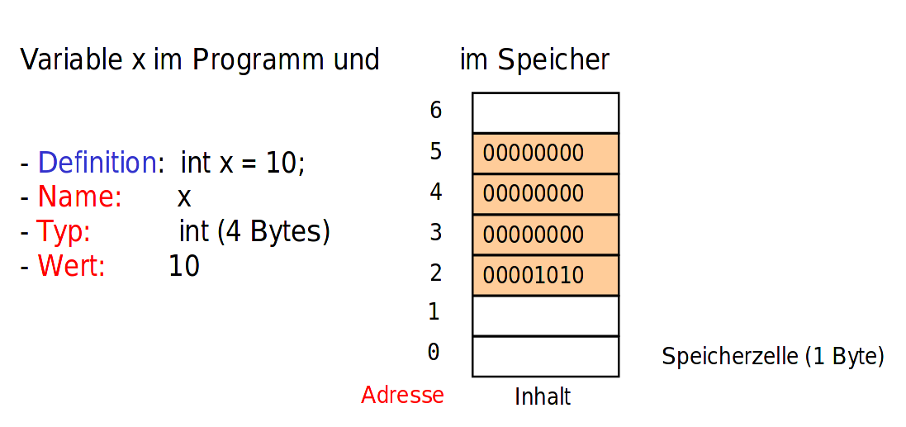
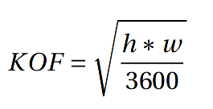

# Software Engineering
by Daniel Glinka
---

# Variablen

- Platzhalter
- Programme dynamisch gestalten
- Reservierter Speicherbereich
- Bezeichner kann selbst gewählt werden

+++

## Aufbau

- Name (Bezeichner)
- Typ (interne Darstellung)
- (Adresse) (wo im Speicher)
- Wert (variabel)

+++

## Im Speicher



+++

## Konventionen

- sprechende Namen
- keine Umlaute
- in der Regel auf Englisch
- Programmiersprache spezifische Konventionen ([Java](https://www.oracle.com/technetwork/java/codeconventions-135099.html))

+++

## Erstellung/Zuweisung

| Schritt          | Java               |
| -------          | ----               |
| Deklaration      | int diameter;      |
| Zuweisung        | diameter = 90;     |
| in einem Schritt | int diameter = 90; |

___

# Datentypen

+++

- Java ist eine streng typisierte Sprache
- Jede Variable hat genau einen Datentyp
- Ein festgelegter Datentyp kann nicht geändert werden
- Gibt an, wie die Daten gespeichert werden
- Legt Wertebereich fest

+++

```java
// Datentyp Integer (Ganzzahlen) => int
int x = 10;

// Datentyp String (Zeichenkette) => String
String x = "10";

int x = "10"; // ERROR!
int x = abc;  // ERROR!

int x = 25;   // x hat den Wert 25
x = 10;       // x hat den neuen Wert 10
x = "15";     // ERROR!
```
+++

## Wertebereich

boolean (1b) < byte (1B) < char (1B) < short (2B) < int (4B) < float (4B) long (8B) < double (8B)

```java
byte x = 127 // x hat den Wert 127
x = 128      // ERROR! => Overflow
```

+++

## Beispiel mit C

##### Code
```c
#include "stdio.h"
int main() {
  char x = 127;
  printf("x = %d\n", x);

  x = x + 1;
  printf("x = %d\n", x);

  return 0;
}
```

##### Output
```bash
x = 127
x = -128
```

+++

## Overflow in Binär

##### Zahlen in Binär (byte/char)
```
-128 = 1000 0000
-1   = 1000 0001 
 0   = 0000 0000
 1   = 0000 0001
 127 = 0111 1111
```
##### Rechnen in Binär
```
+ = Bitweises OR (|)

    0111 1111
  | 0000 0001 
  -----------
    1000 0000
```

---

# Operatoren


+++

## Zuweisungs Operator (=): 

```java
int x = 3;
x = 15;
int y = 2;
x = y;
```

Achtung!!!: `a=b` ist nicht das gleiche wie `a==b`
+++

## Arithmetische Operatoren (+,-,*,/, %): 

Punkt-vor-Strich und Klammerregeln, wie in der Mathematik.

```java
int x = 3;
x = 15 + 5;
int y = 24;

x = x * y;

// Modulo % --> gibt den ganzzahligen Rest einer Division an
int z = 30 % 14; // z hat den Wert 2;
```

###  Achtung!!! bei / :

```java
int x = 6;
int y = 4;
int z = x/y;
print(z);      // z hat den Wert 1;

int x = 6;
float y = 4.0;
float z = x/y;
print(z);      // z hat den Wert 1.5;
```

+++

### Kurzformen

```java
int x = 1;
int y = ++x; // x wird erst erhöht und dann in y gespeichert
int z = y++; // y wird erst in z gespeichert und dann erhöht
int a = x--; --x; // x wird erst in a gespeichert und dann verringert

println(y);  // y hat den Wert 3
println(z);  // z hat den Wert 2
println(a);  // a hat den Wert 2
```

## Vergleichsoperatoren

| Vergleich      | Operator |
| -----          | -----    |
| Gleichheit     | ==       |
| Ungleichheit   | !=       |
| Kleiner        | <        |
| Kleiner gleich | <=       |
| Größer gleich  | >=       |
| Größer         | >        |

+++

## Logische Operatoren

| Operand 1 | Operand 2 | AND   | OR    | XOR   |
| ----      | ----      | ---   | ---   | ---   |
| false     | false     | false | false | false |
| true      | false     | false | true  | true  |
| false     | true      | false | true  | true  |
| true      | true      | true  | true  | false |

##### Operatoren

- AND => &&
- OR => ||
- XOR => kann mit (x != y) nachgebaut werden

##### Negation

`!true == false`

##### Bitweise Manipulierung

- AND => &
- OR => |
- XOR => ^
- Bitshift-Left => <<
- Bitshift-Right => >>

```java
println(4 & 2);  // 0 => 0100 & 0010 = 0000
println(4 | 2);  // 6 => 0100 | 0010 = 0110 /* So rechnet eine CPU intern */
println(4 ^ 2);  // 0 => 0100 ^ 0010 = 0110 
println(4 << 2); // 16 => 0100 << 2 = 0001 0000
println(4 >> 2); // 1 => 0100 >> 2 = 0001
```

+++

# Wandlungsfähigkeit

Anders als in der Mathematik müssen Operatoren auch andere Datentypen als Zahlen bedienen. Daher sind sie Wandlungsfähig in Abhängigkeit vom Datentyp.

##### Beispiel:
```java
int i = 15 + 23;
String s = "Hallo " + "Welt";
String t = 15 + " ist ein hier ein Text";
```

---

# Übungen

+++

## Einfache Rechenaufgaben

Schreibe ein Programm, das die bei den Testfällen stehenden Rechenaufgaben berechnet,die Ergebnisse in einer Variablen speichert und die Werte der Variablen in der Konsoleausgibt.

```
1 + 7 - 9 + 43 = 42                        12 % 2 = 0
43 - 9 + 7 + 1 = 42                        13 % 5 = 3
4 * 3 + 1 = 13                             12345 / 10 = 1234
9 * (2 + 1) = 27                           1234 / 10 = 123
4 * 3 / 6 = 2                              123 / 10 = 12
(3 - 7) * (7 + 4) = -44                    12 / 10 = 1
3 / 4 = 0                                  1 / 10 = 0
3.0 / 4.0 = 0.75                           12345 % 10 = 5
4 / 3 + 1 * 7 = 8                          1234 % 10 = 4
4.0 / 3.0 + 1 * 7 = 8.333333               123 % 10 = 3
2 * 2 * 2 * 2 * 2 * 2 * 2 = 128            12 % 10 = 2
42 / 7 / 3 = 2                             1 % 10 = 1
```

+++

##### Tipp
- NaN (Not a Number) => Es wurde eine Division mit 0 durchgeführt

+++

## Perlenkette Reloaded

Programmiere die angegebene Zeichnung unter Verwendung der Processing-Grundelemente. Nutze dabei Variablen und Operatoren. Die Lösung ist richtig, wenn das Programm mit einer änderung der Perlengröße zurechtkommt.


+++

##### Tipp:

- Speichere die Startposition (X-Koordinate), Y-Koordinate und den Radius jeweils in einer Variable
- Mit der Startposition und dem Radius kannst du die Position des nächsten Kreises ausrechnen

+++

## Berechnung Körperoberfläche

Schreibe ein Programm, das die Körperoberfläche nach der Formel in _m²_ berechnet.



In der Formel bezeichnet _h_ die Körpergröße in cm und _w_ das Körpergewicht in kg. Das Ergebnis ist die Körperoberfläche in m².

1.80 m und 58 kg => 1.7029387

+++

##### Tipp:

- für die Wurzel (sqrt) gibt es eine Processing Methode (siehe Referenz)
- Achte bei Division darauf, dass die Nenner aus Kommazahlen bestehen

+++

## Tic-Tac-Toe Spielfeld

Schreibe ein Programm, das ein leeres Spielfeld für Tic-Tac-Toe erzeugt und darstellt. Machedabei Gebrauch von geeigneten Variablen!


+++

##### Tipp:

- Überlege dir, wie die Elemente im Fenster platziert werden und welche Formen passend sind
- Verwende Variablen bei wiederholdenden Zahlenwerten
