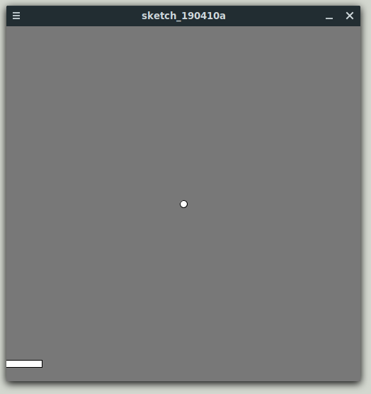

# Software Engineering
by Daniel Glinka
---

# Funktionen

+++

- Eine Menge von Anweisungen
- Code separieren
- Code mehrfach verwenden

+++

## Vorteile

- Code bleibt übersichtlich
- Geringerer Schreibaufwand
- Weniger Fehler
- Änderungen müssen nur an einer Stelle gemacht werden

---

## Syntax (Java)

- Rückgabetyp
- Funktionsname
- Parameterliste
- Anweisungsblock

+++

#### Signatur

Funktionen müssen EINDEUTIG identifizierbar sein. Die "Signatur" um sie identifizierbar zu machen besteht aus:

- Rückgabetyp
- Funktionsname
- Parameterliste

+++

```java
int BerechneSumme(int a, int b) {
  // Anweisungen zur Berechnung
  return ergebnis;
}
```

+++

#### Rückgabetyp

Der Rückgabetyp entspricht dem Datentyp, des Elements das nach dem `return`-Statement angegeben wird.

Wenn die Funktion keinen Wert zurück gibt, verwendet man den Rückgabetyp `void`.

+++

#### Funktionsname

- Frei wählbar
- Beschreibt den Sinn/die Aufgabe der Funktion
- Funktion erfüllt NUR was der Name beschreibt

+++

##### Beispiel:

Funktion `BerechneGehalt` sollte nur das Gehalt berechnen und zurückgeben. NICHT!! den Datensatz laden, nach der Berechnung speichern und in der Konsole ausgeben.

=> 4 verschiedene Funktionen verwenden.

+++

#### Parameterliste

- Parameter sind optional
- Parameter sind durch Komma getrennt
- Beliebige Anzahl (je weniger desto besser)

+++

##### Gültigkeit

Wie bei Blöcken sind Variablen/Parameter nur innerhalb des Funktionsblock gültig. Wenn Variable benötigt wird, sollte diese als Parameter übergeben werden. 

---

# Übungen

+++

## Endliches Produkt

Das endliche Produkt ist eine mathematische Funktion und multipliziert Zahlen von einem Startwert s bis zu einen Endwert e.

- e oder s < 0 --> Ergebnis 0
- e oder s == 0 --> Ergebnis 0
- e < s --> vertausche e und s

+++

Schreibe eine Funktion, welche das "endliche Produkt" berechnet.

```java
Startwert s, Endwert e

s = 3, e = 4 --> 12
s = 5, e = 2 --> 120
s = -3, e = 5 --> 0
s = 33, e = 0 --> 0
s = 0, e = 33 --> 0
```

+++

##### Tipp:

- Überlege wie Parameterliste aussehen muss. Welche Parameter und welchen Datetyp diese haben.
- Überlege, ob die Funktion einen Wert zurückliefert. Berechnet die Funktion ein Ergebnis, das zurückgegeben werden soll?
- Bedingte Anweisungen und Wiederholungsanweisungen werden im Funktionsblock benötigt.

+++

##### Hilfe:

```java
// Erstelle eine Funktion mit dem Namen product, welche den Startwert s und
// Endwert e als Parameter erhält. Die Funktion soll das Ergebnis der Berechnung
// zurückliefern.
/*...*/ product(/*...*/) {

  // Ist einer der beiden Werte kleiner 0?
  // Wenn das zutrifft, soll 0 zurückgegeben werden
  /*...*/
  // Ist einer der beiden Werte gleich 0?
  // Wenn das zutrifft, soll 0 zurückgegeben werden
  /*...*/
  // Ist e kleiner s?
  // Vertausche die Werte
  /*...*/
  
  
  // Deklaration und Initialisierung der Variablen für das Ergebnis
  // Der Startwert muss 1 sein (wegen Multiplikation)
  int result = 1;
  
  // Zähle vom Start- bis Endwert
  // und multipliziere die Zahl mit dem Ergebnis
  /*...*/

  // Das Ergebnis zurückliefern
  return result;
}

// Startpunkt des Hauptprogramms
// Hier wird die implementierte Funktion zu Demonstrations- und
// Testzwecken aufgerufen.
void setup() {
  int result = product(4, 3);
  println("product(4, 3): " + result);
}
```

+++

## Fakultät berechnen

Die Fakultät ist eine mathematische Funktion und multipliziert alle natürlichen Zahlen vom Startwert 1 bis zum Endwert n.

+++

Programmiere eine Funktion, die die Faktultät für eine natürliche Zahl n berechnet.

```
n = 6 --> 720
n = 2 --> 2
n = 1 --> 1
n = 9 --> 362880
```

+++

##### Tipp:

- Schau dir das Programm zum endlichen Produkt noch einmal an

+++

##### Hilfe:

```java
// Erstelle eine Funktion factorial, welche den Endwert n
// als Parameter erhält und die Fakultät des Wertes berechnet.
// Tipp: rufe in der Funktion die Berechnung des endlichen Produktes auf
/*...*/

void setup() {
  int result = factorial(6);
  println(result);
}
```

+++

##### Lösung

```java
// Erstelle eine Funktion mit dem Namen product, welche den Startwert s und
// Endwert e als Parameter erhält. Die Funktion soll das Ergebnis der Berechnung
// zurückliefern.
int product(int e, int s) {
 
  // Ist einer der beiden Werte kleiner 0?
  // Wenn das zutrifft, soll 0 zurückgegeben werden
  if(s < 0 || e < 0) {
    return 0; 
  }
  
  // Ist einer der beiden Werte gleich 0?
  // Wenn das zutrifft, soll 0 zurückgegeben werden
  if(s == 0 || e == 0) {
    return 0; 
  }
  
  // Ist e kleiner s?
  // Vertausche die Werte
  if (e < s) {
    int tmp = e;
    e = s;
    s = tmp;
  }
 
 
  // Deklaration und Initialisierung der Variablen für das Ergebnis
  // Der Startwert muss 1 sein (wegen Multiplikation)
  int result = 1;
 
  // Zähle vom Start- bis Endwert
  // und multipliziere die Zahl mit dem Ergebnis
  for(int i = s; i <= e; i++) {
    result = result * i;
  }
 
  // Das Ergebnis zurückliefern
  return result;
}

// Erstelle eine Funktion factorial, welche den Endwert n
// als Parameter erhält und die Fakultät des Wertes berechnet.
int factorial(int n) {
 return product(1,n); 
}
 
// Startpunkt des Hauptprogramms
// Hier wird die implementierte Funktion zu Demonstrations- und
// Testzwecken aufgerufen.
void setup() {
  int result = factorial(6);
  println("product(8, 15): " + result);
}
```
+++

## Pong

Programmiere das Spiel Pong.



---

# Weitere Beispiele

- [Processing Examples](https://processing.org/examples/)
