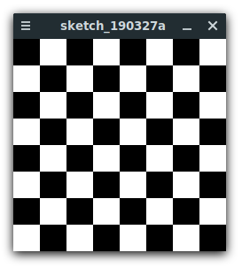

# Software Engineering
by Daniel Glinka
---

# Kontroll-strukturen

+++

- Abläufe steuern
- geben an, in welcher Reihenfolge und wie oft Anweisungen ausgeführt werden
- Bedingte Anweisungen
  - Code wird nur unter bestimmten Bedingungen ausgeführt
- Wiederholungsanweisungen
  - Code wird mehrfach ausgeführt
  
---

## Bedingte Anweisungen

- `if-else` Anweisung
  - Unterscheidet 2 Fälle (wenn "x", dann "y", _sonst "z"_)
- `switch` Anweisung
  - Unterscheided 3 oder mehr Fälle
- Blöcke

+++

### if-else

```java
// Recap: Boolsche Ausdrücke ergeben immer true oder false (x == y, a <= b, etc.)
if(<boolescher Ausdruck>) {
  // In diesen geklammerten Block kommen alle die Anweisungen hinein,
  // die abgearbeitet werden, wenn die Bedingung wahr ist.
} 
else if (<boolscher Ausdruck>) {
  // in diesem Block kommen alle Anweisungen hinein,
  // die abgearbeitet werden, wenn die "if" Bedingung falsch ist und die "if else" Bedingung wahr ist.
}
else {
  // In diesen geklammerten Block kommen alle Anweisungen hinein,
  // die abgearbeitet werden, wenn die Bedingungen falsch sind.
}
```

`else` ist optional. Wenn dieser Block nicht benötigt wird, kann man ihn komplett weg lassen.

+++

### switch

```java
switch(<Ausdruck>) {
  case <Konstante_1>:
    <Anweisungsblock_1>;
    break;
  case <Konstante_2>:
    <Anweisungsblock_2>;
    break;
  ...
  case <Konstante_n>:
    <Anweisungsblock_n>;
    break;
  default:
    <Anweisungsblock_sonst>;
}
```

`break` beendet die Ausführung der umgebenden Struktur sofort. Wird ein `break` vergessen, werden die nächsten Anweisungsblöcke bis zum nächsten `break` bzw. Ende der `switch`-Anweisung auch ausgeführt.

`default` beschreibt den "sonst"-Fall und ist optional. Allerdings ist es gute Praxis, immer einen `default` zu haben.

---

## Wiederholungs-anweisungen (Schleifen)

+++

- `for`-Schleife
  - "Kopfgesteuerte"-Schleife
- `while`-Schleife
  - "Kopfgesteuerte"-Schleife
  - "Fußgestuerte"-Schleife

+++

### for-Schleife

```java
for(int i=1; i<10; i++) {
  // In diesen geklammerten Block kommen alle die Anweisungen hinein,
  // die wiederholt abgearbeitet werden sollen.
}
```

Eine Endlosschleife erhält man mit `for (;;){// Anweisungen}`. Dies ist allerdings in den meisten Fällen unerwünscht.

+++

### while-Schleife (Kopfgesteuert)

```java
int i = 0;
while(i<10) {
  // Anweisungen, die abgearbeitet werden sollen
  i++;
}
```

Eine Endlosschleife erhält man mit `while(true){// Anweisungen}`.

+++

### while-Schleife (Fußgesteuert)

```java
int i = 0;
do {
  // Anweisungen, die abgearbeitet werden sollen
  i++;
} while(i<10)
```

Eine Endlosschleife erhält man mit `do {// Anweisungen} while(true)`.

+++

`break` funktioniert auch bei allen Schleifen. Das bedeutet, bei einem `break` macht das Programm mit der nächsten Zeile außerhalb der Schleife weiter.

`continue` ist ein Schlüsselwort, das nur in Schleifen erlaubt ist. Bei `continue` wird der aktuelle Durchlauf beendet und ein "neuer" Durchlauf gestartet. Bei der `for`-Schleife wird "Aktualisierungs"-Anweisung noch ausgeführt.

+++

## Blöcke

- Verbundanweisung
- Variablen, welche in einem Block deklariert wurden sind außerhalb nicht verfügbar

```java
{
  int x = 5;
}
println(x); // ERROR
```

+++

## Verschachtelungen

Alle Strukturen können beliebig verschachtelt werden.

```java
int i;
for(i = 1; i < 10; i = i + 1) { 
  if(i % 2 != 0) {
    while (i > 5) {
      print(i + " ");
      break;
    }
    continue;
  }
  print(i + " ");
}

// Ausgabe: 2 4 6 7 8 9
```

---

# Übungen

+++

## Maximum bestimmen

Schreibe ein Programm, welches das Maximum von drei Integer-Variablen bestimmt und in der Kommandozeile ausgibt. Benutze bei den Vergleichen ausschließlich `if-else`-Anweisungen sowie den `>`-Operator.

```
Vorliegende Zahlen: 1, 2, 3 --> Maximum davon: 3
Vorliegende Zahlen: 42, 7, 13 --> Maximum davon: 42
Vorliegende Zahlen: -9, 4, 2 --> Maximum davon: 4
```

+++

##### Tipp:

- Erstelle erst die Variablen der Zahlen und die Variablen, welche den maximalen Wert haben soll.
- Anschließend kannst du mit `if-else` das Maximum bestimmen.
- Wenn Variable a größer ist als b und c, ist a das Maximum. Wenn b größer ist als a und c, dann ist b das Maximum. Trifft beides nicht zu, ist c das Maximum.

+++

## Summe berechnen

Schreibe ein Programm, welches mit einer `for`-Schleife die Summe der Zahlen von 3 bis 27 berechnet und das Ergebnis in der Konsole ausgibt.

```
Summe von 3 bis 27 --> 375
Summe von 1 bis 100 --> 5050
```

+++

##### Tipp:

- Deklariere und initialisiere eine Variable für die Summe
- Gehe in einer Schleife die Zahlen von 3 bis 27 durch
- Addiere zur Summenvariable die aktuelle Zählerzahl

+++

## Tippspiel

Bei Fußballwettspielen werden die erzielten Wettpunkte nach folgenden Regeln ermittelt:
- Exakter Tipp (3 Punkte): 
  - Sieg (z.B. Ergebnis: 3:2, Tipp: 3:2)
  - Niederlage (z.B. Ergebnis: 0:1, Tipp: 0:1)
  - Unentschieden (z.B. Ergebnis: 2:2, Tipp: 2:2)
- Richtige Tendenz (1 Punkt):
  - Sieg (z.B. Ergebnis: 3:2, Tipp: 2:1)
  - Niederlage (z.B. Ergebnis: 0:1, Tipp: 1:2)
  - Unentschieden (z.B. Ergebnis: 2:2, Tipp: 1:1)
- Sonst 0 Punkte

+++

Schreibe ein Programm, das für ein Fußballtippspiel die erzielten Punkte berechnet und das Ergebnis in der Konsole ausgibt. Dazu werden das getippte Ergebnis und das tatsächlich erzielte Ergebnis des Fußballspiels benötigt.

Bei Veränderung der variablen sollen folgende Ergebnisse ausgegeben werden:
```java
Ergebnis: 3:2, Tipp: 3:2 → Punkte: 3
Ergebnis: 0:1, Tipp: 1:2 → Punkte: 1
Ergebnis: 2:2, Tipp: 1:1 → Punkte: 1
Ergebnis: 0:1, Tipp: 1:1 → Punkte: 0
```

+++

##### Tipp:

- Deklariere und initialisiere Variablen für den Tipp und das Ergebnis des Fußballspiels.
- Prüfe anhand der Variablen, welche Punktzahl zutrifft (z.B. mit `if` oder `else if`).
- Schreibe diese Punktzahl in die Konsole.

+++ 

##### Hilfe:

```java
// Ergebnis des Spiels
int home = 3;
int guest = 2;

// Getipptes Ergebnis
int betHome = 3;
int betGuest =2;

// Berechnete Punkte
int point = 0;

if (/* exakter Tipp */) {
  points = 3;
}
// Tipp: Tendenz durch Subtraktion berechnen (home - guest) > 0 && (betHome - betGuest) > 0
else if (/* richtige Tendenz (Sieg Home) */) {
  points = 1;
}
else if (/* richtige Tendenz (Sieg Guest) */) {
  points = 1;
}
else if (/* richtige Tendenz (Unentschieden) */) {
  points = 1;
}
else {
  points = 0;
}

```

+++

## PIN-Code-Generator

Schreibe ein Programm, das alle viestellingen PINs einer Bankkarte oder Passcodes erzeugt und in der Konsole ausgibt. Alle PINs sind vierstellig!

##### Ausgabe:

```
0000
0001
0002
...
9998
9999
```

+++

##### Tipp:

- Mit Schleifen Alle PINs durchgehen.
- Prüfen, ob die Zahl ein-, zwei-, oder dreistellung ist. Gegebenenfalls Nullen hinzu fügen.
- Wenn nicht alle Einträge sichtbar sind, kannst du die Schleife mit dem befehlt delay(1) verlangsamen. Delay fügt eine Pause von einer Millisekunde in das Programm ein.

+++

##### Hilfe:

```java
// Gehe alle PIN-Zahlen durch
for (/* ... */) {

  // Füge bei einstelligen Zahlen drei Nullen hinzu
  if (/* ... */){
    print("000");
  }
  // Füge bei einstelligen Zahlen drei Nullen hinzu, etc.
  // ...
  
  // Gebe PIN-Zahl mit Zeilenumbruch aus
  
  // Verlangsamung der Ausgabe
  delay(1);

}
```

+++

## Ladevorgang

Erstelle ein Ladevorgang Rädchen wie in folgendem Bild dargestellt:


+++

##### Tipp:

- Nutze lies dir in der Referenz die Funktionen `translate()` und `rotate()` durch.
- Der Winkel für die Rotation beträgt 45° (= `PI/4.0` in Bogenmaß)

+++

##### Hilfe:

```java
size(400, 400);
background(255);
smooth();
strokeWeight(30);
strokeCap(ROUND);

// Verschiebe Nullpunkt des Koordinatensystems von der Ecke links oben
// des grafischen Ausgabefensters ins Zentrum.

// ...

// Zeichne die 8 Linien mit dem line Befehl
// und rotiere das Koordinatensystem mit dem rotate Befehl
// in einer Schleife
for (/* ... */) {
   
}
```

+++

## Dominosteine

#### Vorübung

Erzeuge diese Pattern mithilfe von `for`-Schleifen

```
#                     1
##                    1 2
###                   1 2 3
####                  1 2 3 4
#####                 1 2 3 4 5
######                1 2 3 4 5 6
#######               1 2 3 4 5 6 7
```

+++

##### Hilfe:

```java
// Forschleife für die Zeilen
for (/* ... */) {

  // Forschleife für die Zahlen (Abhängig von "Zähl"-Variable in äußerer Schleife)
  for (/* ... */) {
    // Anzeigen des Zeichens/Zahl in Konole
  }

  // Zeilenumbruch
  println();
}
```

+++

#### Aufgabe:

Erstelle ein Programm, welches mithilfe von `for`-Schleifen alle Spielsteine (ohne Dopplungen) des Legespiels Domino ausgibt.

```
(0|0)(0|1)(0|2)(0|3)(0|4)(0|5)(0|6)
     (1|1)(1|2)(1|3)(1|4)(1|5)(1|6)
          (2|2)(2|3)(2|4)(2|5)(2|6)
               (3|3)(3|4)(3|5)(3|6)
                    (4|4)(4|5)(4|6)
                         (5|5)(5|6)
                              (6|6)
```

+++

##### Tipp:

- Mit jeder Zeile verringert siche die Anzahl der ausgegeben Steine und die Startzahl wird um 1 erhöht
- Wie in der Vorübung kannst du zwei Schleifen ineinander verschachteln
- Erzeuge zunächst die Leerzeichen und gebe dann die Dominosteine in der Zeile aus. Ist die Zeile fertig, kannst du einen Zeilenumbruch erzeugen.

+++

##### Hilfe:

```java
// For-Loop für Zeilen (0 -> 6)
for (/* ... */) {
  // Erzeuge Leerzeichen (Abhängig von Zeile)
  // ...
  
  // Gebe Dominosteine aus (Abhängig von Zeile)
  // ...
  
  // Zeilenumbruch
  println();
}
```

+++

## Schachbrett

Programmiere ein Schachbrett. Nutze dafür drei If-Anweisungen und Wiederholungsanweisungen.




+++

##### Tipp: 

- Gehe jede Zeile und Spalte durch und male dabei jeweils erst ein weißes und dann ein schwarzes Viereck. Speichere die Farbe als `boolean`-Variable, die mit jedem Schritt zwischen `true` und `false` wechselt.
- Verschiebe den Koordinatenursprung zum Zeichnen der Vierecke (erleichtert die Rechnungen**
- Achte darauf, dass jede Zeile nicht mit der gleichen Farbe der vorherigen Zeile beginnt.

+++

##### Hilfe:

```java
size(800, 800);
noStroke();

// Soll aktueller Kasten schwarz sein?
boolean black = true;

// Größe pro Feldelement
int size = 100;

// Gehe jede Spalte durch 
// (max Anzahl der Spalten: height / size)
for(/* ... */) {

  // Gehe jede Zeile durch
  // (max Anzahl der Zeilen: width / size)
  for(/* ... */) {

    // Male Farbe abhängig von black Variable
    // ...

    // Kehre black Variable um
    // ...

    // Male Element
    // ...

    // "Wandere" ein Feld nach rechts
    translate(size, 0);
  }

  // Ende der Zeile erreicht

  // "Wandere" in nächste Zeile 
  // (um die Spielfeldbreite nach links 
  // und um die Höhe eines Feldes nach unten)
  // ...

  // Kehre Variable nochmals um, da Muster
  // immer mit letzter Farbe anfängt
  // ...
}
```

+++


## Interaktiver Button

Erstelle ein blaues Rechteck, welches sich grün Färbt, wenn sich der Mauszeiger über ihm befindet. Die x- und y-Koordinaten der Mausposition können wir mit den Variablen `mouseX` bzw. `mouseY` herausfinden.

+++

Nutze dafür das folgende Template:
```java
public voidsetup() {
  size(800, 800);
}

public voiddraw() {
  // Hier kommt das geforderte Programm hinein
  // Dieser Bereich wird durchgehend aufgerufen
  
  // Position und Größe des Buttons (Variablen x, y, w, h)
  // ...
  
  // Färbe Rechteck von Mausposition ein
  // wenn Maus direkt über Rechteck -> Grün
  // ...
  
  // Sonst Blau
  // ...
  
  // Zeichne Rechteck
  // ...
}
```

+++

##### Tipp:

- Ein Button hat folgende Eigenschaften:


+++

- Mögliche Mauspositionen für die die angegebene Vergleichsanweisung "wahr" ist


+++

- Kombination der Vergleichsanweisungen


