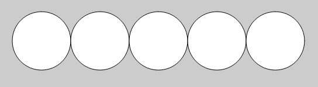

# Software Engineering
by Daniel Glinka
---

# Programmieren

+++

## Aufbau

- Abfolge von Anweisungen
- "Rezept"

+++

### Beispiel (Java)

```Java
nameAnweisung1();
nameAnweisung2(parameter);
nameAnweisung3(parameter1, parameter2);

nameAnweisung4(); nameAnweisung5(); 
```

+++

### Beispiel (Java)

```java
print("Hallo "); print("Welt!");

```
### Beispiel (Python)

```python
print("Hallo ")
print("Welt!")

```
+++

Alle Anweisungen findet man [hier](https://processing.org/reference/)

---

# Processing

+++

- Basiert auf Java
- [https://processing.org](https://processing.org/)
- [Referenz](https://processing.org/reference/)

+++


---

# Getting Started

+++

## Weihnachtsbaum

Schreibe ein Programm, das das folgende Muster in der Konsole ausgibt:

```bash
      *
     ***
    *****
   *******
  *********
 ***********
*************
     ***
```

+++

##### Tipp:
- Es gibt 2 Anweisungen, mit denen Text in der Konsole ausgegeben wird.
- Sternchen und Leerzeichen helfen weiter ;-)

+++

## Perlenkette

Programmiere das angegebene Bild mithilfe der grafischen Grundelemente von Processing:



+++

##### Tipp:
- Lies den Ellipsen Befehl in der Referenz nach
- Du kannst die Bildschirm größe mit `size(x,y)` festlegen

+++

## Grafische Elemente

```java
// Die Größe des grafischen Ausgabefensters wird auf 450 Pixel
// in der Breite und 320 Pixel in der Höhe festgelegt.
// Die Hintergrundfarbe ist weiß.
size(450, 320);
background(255);

// Die grafischen Grundelemente im angegebenen Bild werden von links
// nach rechts gezeichnet. Dazu muss für jedes Element zuvor die
// Füllfarbe und Linienfarbe spezifiziert werden.

// Das rote Rechteck
stroke(255, 0, 0);         // Linienfarbe ist blau
fill(255, 0, 0);           // Füllfarbe ist blau
rect(10, 10, 100, 300);

// Der grüne Kreis
stroke(0, 255, 0);
fill(0, 255, 0);
ellipse(200, 160, 100, 100);

// Die blaue Linie
strokeWeight(10);          // Strichstärke auf 10 Pixel setzen
stroke(0, 0, 255);
line(310, 10, 310, 300);

// Das gelbe Dreieck
strokeWeight(1);
stroke(255, 255, 0);
fill(255, 255, 0);
triangle(400, 10,          // Punkt oben
         370, 310,         // Punkt unten links
         440, 310);        // Punkt unten rechts

```
+++

## Ghettoblaster

Programmiere in Processing die Zeichnung eines Ghettoblasters. Er soll in dieser Form gestaltet werden:


+++

##### Tipp:
- Erstelle eine Skizze mit Koordinatensystem (Nullpunkt ist oben links)
